# ADR-0027: Versioned prediction, execution and serving contracts

**Status:** Accepted
**Date:** 2026-09-10

## Context

Training, artifact analysis, smoke validation and serving reconstructed the same
models separately. Feature cache identity omitted parts of the computation;
process working directories carried run identity; publishers pruned with stale
manifest snapshots; clients could decode payloads while describing obsolete
comparison semantics. Repository-wide review identified these as coupled
ownership problems. The implementation retains the six position adapters, raw
target/scoring rules and eager production training.

## Decision

Use explicit contracts within one repository and the existing training/serving
deployment split. Do not introduce network services between these packages.

| Owner | Contract and responsibility |
|---|---|
| `src/training` | Immutable resolved feature/model/training recipe; named prepared data and results; absolute `RunContext` paths; separate artifact/figure sinks |
| `src/prediction` | Ordered input schemas; self-describing per-family model bundles; a common loader/raw predictor and frame adapter |
| `src/data` | Shared identity normalization and typed source outcomes; captured provider response records for selected training inputs |
| `src/evaluation` | Pure metrics and explicit evaluation records with separate fitted-data and held-out-row identities |
| `src/artifacts` | Conditional publication, approved fallback, receipts, coordinated retention and immutable serving generations |
| `src/orchestration` | Dataset selection/verification and build plans binding source, image, inputs and expected outputs |
| `src/contracts` | Versioned HTTP wire definitions shared by client validation and fixtures |
| `src/serving` | App-owned working state, detached published request snapshots and HTTP presentation |

### Model bundles

Each served family writes a descriptor beside its weights/scaler. CPU and NN
bundle indices let split jobs merge independent families without collisions.
Descriptors contain ordered static, game, opponent and kick input names; target
names/units; the actual constructor arguments; fitted imputation/scaling/clipping
state; training options; dependency/code/data/build identities; and file digests.
The constructor recorder adds no tensors or random draws. Ridge and LightGBM
retain their existing fitted serialization formats under the bundle envelope.

`Predictor` verifies and copies each descriptor's bytes into a private temporary
generation **before** deserializing them. A checksum check followed by reopening
mutable filenames is insufficient because an artifact refresh can intervene.
Serving, analysis (including nested K), and smoke tests use this loader. Bundled
families with incompatible fitted data/preparation identities cannot be combined.
Raw prediction and scoring remain separate; unsupported scoring/schema versions
are rejected. Legacy artifacts retain an explicit weaker registry-based reader
until retrained; a missing descriptor in an indexed generation cannot silently
fall back to that reader.

### Execution and feature identity

Position runners accept an explicit `RunContext`; real A/B and ablation runners
isolate their output/data roots without changing process CWD. A named legacy
adapter remains for externally supplied callbacks that do not support contexts.
Context is propagated into thread branches and process workers. K/DST use a
shared split-provider boundary while retaining their specialized history inputs.

Prepared-data identity includes original rows/schema/index, resolved ordered
columns, callable implementation/defaults/closures, bounded preparation source
contents, numerical dependency versions and side-input bytes. Tuning memos use
the same identity. Preparation retries if inputs change during computation;
cache writers use unique temporary files. New preparation dependencies must join
the explicit source manifest. The A/B cache-disable control remains available.

### Artifact and serving release lifecycle

```mermaid
flowchart LR
    Inputs[Identified dataset and providers] --> Plan[Source, image, plan and reserved intent]
    Plan --> Train[Position training]
    Train --> Bundle[Verified bundle and smoke result]
    Bundle --> Receipt[Canonical validated output receipt]
    Receipt --> Model[Conditional approved model pointer]
    Model --> Build[Off-container prediction builder]
    Build --> Generation[Immutable serving generation]
    Generation --> Request[App-owned request snapshot]
```

Model candidates are immutable objects; approval and rollback follow ADR-0011.
Manifest writes use ETag preconditions and revision nonces. A coordinated
operator collector holds a CAS-owned manifest lock without automatic expiration;
stale publishers fail, and only unreferenced eligible objects can be collected.
Retained plans, receipts, dataset snapshots and serving-generation references
remain protected. Crash recovery requires the explicit stopped collector token.

New manifests and model history use `releases/v3` beneath the configured model
prefix. Legacy writers cannot overwrite these manifests or collect these
objects. Migration copies approved legacy bytes into the protected namespace
before referencing them.

The predecessor introduced by PR #1560 uses `<prefix>/<POSITION>/releases/`.
Migration reads that protected namespace before the older loose manifest,
preserves its source high-water mark and explicit rollback restriction, and
copies retained bytes into this protocol's namespace. A predecessor rollback
fence is visible when a plan reserves its intent, before any training starts.
The source-revision registration format is shared by both protocols.

The training image records its actual Git SHA; registered first-parent ancestry
establishes source order. A source frontier
survives explicit rollback, so delayed older images cannot reverse the release.
For jobs on the same source, an intent reserved before training binds position,
dataset and run ID to a sequence. One conditional ledger update records both the
counter and immutable binding, so retries cannot make an older run appear newer.
The binding retains the operator rollback epoch independently of GC/CAS
revisions, so a retry cannot evade rollback and collection cannot mimic one.
Split jobs reuse their build plan's intent. These ledgers share the explicit
retention policy of the plans whose retry identities they preserve.
Successful attempts claim one immutable output receipt before model promotion;
competing attempts reuse that output. Failed smoke tests cannot occupy the
successful output slot. Approval of an output and its current serving selection
are separate facts, so mutable promotion status does not enter receipt identity.

Training and serving share ADR-0026's canonical `data/releases` authority.
Schema-2 build plans name `data-release-v1`; `FF_DATA_RELEASE` and
`FF_DATASET_ID` carry that same release ID. Source identity is the canonical
producer fingerprint. Existing schema-1 plans remain readable through an
explicit `dataset-v1` adapter; new publication never creates a second mutable
dataset pointer. Captured provider responses join the sealed raw inventory.
Historical releases without captures replay their sealed derived caches, with
network fallback forbidden. EC2 and other standalone runs also pin canonical
data and claim exact receipts using an explicit run ID. Mutable historical input
selection requires explicit `FF_DATA_RELEASE=legacy`. See the
[build-plan runbook](../training-build-plans.md).

The historical serving release is one immutable generation containing predictions,
metrics, schema/fingerprint metadata and browser snapshot. The generation's
manifest lists its actual model references. Conditional promotion of its pointer
prevents an older builder from overwriting a newer released snapshot. Independent
model-head advancement does not mutate an already-built serving release: runtime
consumers follow the complete snapshot pointer, not the individual model heads.
Cache schema 11 includes the canonical data release and the separate expert
display/comparison totals from ADR-0024. Deployment binds that ID,
producer fingerprint and a verified snapshot generation into the task definition.
Workers can refresh models within the same data release. If the global pointer
moves to another release, an old task can recover its pinned immutable snapshot,
including during rollback. Advancing raw data alone cannot roll the service;
the selected release must have a complete matching serving snapshot.
Downloads verify all files and publish one local generation pointer. Requests
capture one detached generation; refresh constructs the next state separately.

The serving image sets `FF_ALLOW_RUNTIME_INFERENCE=0`. Worker background threads
hydrate published snapshots; model/data downloads and model refresh are retained
only for explicit legacy/local inference mode. `/health` retains its existing
liveness/degradation contract; `/ready` requires a hydrated artifact and never
trains/builds models. Deployment waits for a complete compatible S3 generation
before replacing the service, including during the first migration. Batch,
refresh and EC2 workflows build the historical serving cache before rollout.
Rollout derives the bucket/prefix from the rendered task definition, temporarily
accepts legacy `/ready` 404 responses at the ALB while the new container's strict
readiness probe gates it, and verifies the exact new task revision/image before
tightening the ALB matcher to 200. Failure restores the prior service and health
configuration; the transaction state also supports interrupted-step cleanup.

### Sources, evaluation and clients

Source outcomes distinguish available, partial, empty and unavailable data,
observations, forecasts and imputations. Retrieval time, effective period,
coverage and content identity accompany the values. Auxiliary/live forecasts
use their own provider context rather than inheriting the model's training
snapshot identity. Source clocks alone do not invalidate live prediction caches.

Evaluation records retain cohort definitions/hashes, scoring/sample basis,
source IDs, data/bundle identities and execution regime. Unknown historical
metadata stays explicitly absent. ADR-0024's comparison semantics and the
eager/stacked distinction remain authoritative.

The API publishes its wire contract and version header. Browser validation,
server-generated fixtures and Swift models test the same current semantics.
Swift stores have injectable clients/cache; stale/offline state is explicit.
CI builds the committed web bundle, exercises browser interactions, and compiles
and tests the native client. Dependency declarations live in `pyproject.toml`;
environment-specific requirements are generated without changing their selected
numerical versions. Existing module/CLI compatibility adapters remain during
migration, with import and change-scope checks covering the new owners.

## Consequences and validation

The serving image installs the generated `requirements-serving.txt` subset,
which excludes model execution, plotting and provider-ingestion libraries.
`FF_ALLOW_RUNTIME_INFERENCE=0` selects a read-only artifact runtime at import
time. Successful requests, cold starts and invalid artifacts do not import
training or prediction builders. Every image build runs the API probe against
a temporary six-position artifact and verifies that ML packages are absent.

Offline historical and upcoming-week construction belongs to `src/prediction/`;
provider adapters belong to `src/data/`. The builders use snapshot state from
`src/artifacts/snapshot_state.py` without importing Flask or `src.serving`.
The HTTP state module installs context adapters for requests. Existing Python
imports and CLI entrypoints under `src/serving` remain compatibility adapters
for full local installations; production never loads their inference branch.
Numerical model implementation, fitted bundle formats and scoring are preserved.

Contract violations fail at boundaries instead of becoming plausible predictions.
The migration adds metadata and compatibility adapters; lower line count is not
the acceptance criterion. Retained generations/plans require a future explicit
expiration policy; this change does not guess one or delete their provenance.
Registry tag immutability and production GPU validation remain distinct from
recording image references and CPU numerical parity.

Validation includes interleaved publication/GC/download failures, six-position
nonzero native-versus-loaded parity, frozen-preprocessing replay, source/cache
invalidation, app isolation and request-generation consistency, browser/native
behavior, and actual production-configuration multi-seed baseline/candidate runs.
Measured results and precise environment limits are recorded in the
[validation report](../design-contracts-validation.md) and the PR's benchmark
evidence, not asserted as timeless performance guarantees here.

## Changelog

- 2026-09-11: Enforce nested source isolation and thread capture propagation;
  bind evaluation identities to raw truth and pre-fill availability; preserve
  native/shared row semantics and client request ownership during migration.
  Update strict-recipe and partial-result E2Es (PR #1566 review follow-up).

- 2026-09-11: Rebase the ownership migration on the consolidated evaluation contract; preserve full forecasts, shared comparison totals, source eligibility and DST exclusions in the offline builders and client metadata.

- 2026-09-10: Separate the serving dependency subset and artifact reader from historical/live prediction construction; verify both directions in fresh interpreters and the built image.

- 2026-09-10: Establish the contracts, migrate consumers and add boundary tests (PR #1566).
